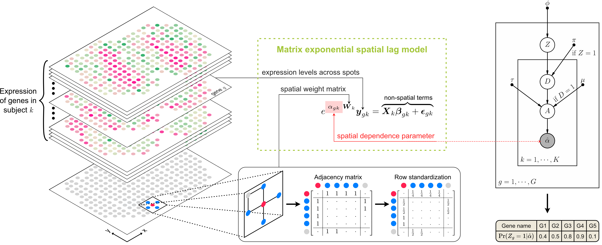

# PopSVG: scalable detection of spatially variable genes in population-level spatial transcriptomics

## Overview

To identify spatially variable genes (SVGs) in population-level spatial transcriptomics, current practices often combine SVGs detected on each slice, or alternatively detect highly variable genes. These two approaches ignore either homogeneity or heterogeneity among subjects. To address this gap, we develop PopSVG, a statistical method that hierarchically models the spatial expression variability in the population, effectively balancing the inter-subject homogeneity and heterogeneity. Extensive experiments demonstrate PopSVG’s superiority over existing approaches in identifying biologically relevant SVGs, improving multi-slice tissue domain segmentation, and scaling to large datasets.

## Installation

## Tutorials
### The CPU version

### The GPU version

## Tested environments
|               | Environment 1             | Environment 2          |
|---------------|---------------------------|------------------------|
| **CPU**       | Intel Xeon Platinum 8276L | Intel Xeon Gold 6240R  |
| **GPU**       | NVIDIA RTX 3090           | NVIDIA RTX A6000       |
| **Memory**    | 256 GB                    | 256GB                  |
| **System**    | Ubuntu 24.04.2 LTS        | Ubuntu 22.04.5 LTS     |
| **Python**    | 3.12.9                    | 3.11.11                |

## Citation
Coming soon.